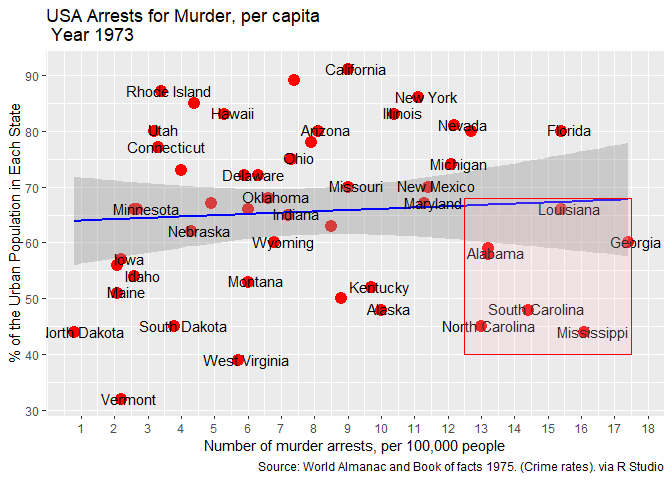

``` r
library(ggplot2)
```

    ## Warning: package 'ggplot2' was built under R version 4.2.3

``` r
library(datasets)
data("USArrests", package = "datasets")

p <- ggplot(USArrests, aes(x= Murder, y=UrbanPop,)) + 
  geom_point(aes(color = Murder), size=4, col="red") + 
  scale_x_continuous(breaks = 1:18) + 
  geom_smooth(method="lm", col="blue", size=1) + 
  geom_text(label=rownames(USArrests), nudge_x = 0.25, nudge_y = 0.25, check_overlap = T) + 
  ggtitle("USA Arrests for Murder, per capita \n Year 1973") + xlab("Number of murder arrests, per 100,000 people") + 
  ylab("% of the Urban Population in Each State") + 
  labs(caption = "Source: World Almanac and Book of facts 1975. (Crime rates). via R Studio") + 
  annotate("rect", xmin=c(12.5),xmax = c(17.5), ymin = c(40), ymax = (68), alpha=0.2, color="red", fill="pink")
```

    ## Warning: Using `size` aesthetic for lines was deprecated in ggplot2 3.4.0.
    ## ℹ Please use `linewidth` instead.
    ## This warning is displayed once every 8 hours.
    ## Call `lifecycle::last_lifecycle_warnings()` to see where this warning was
    ## generated.

    ## `geom_smooth()` using formula = 'y ~ x'

<!-- -->
